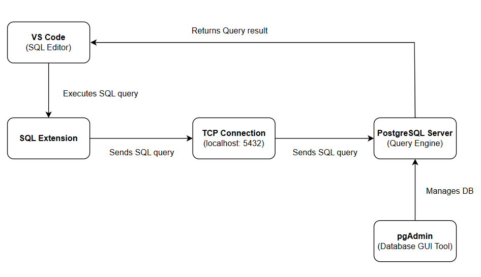
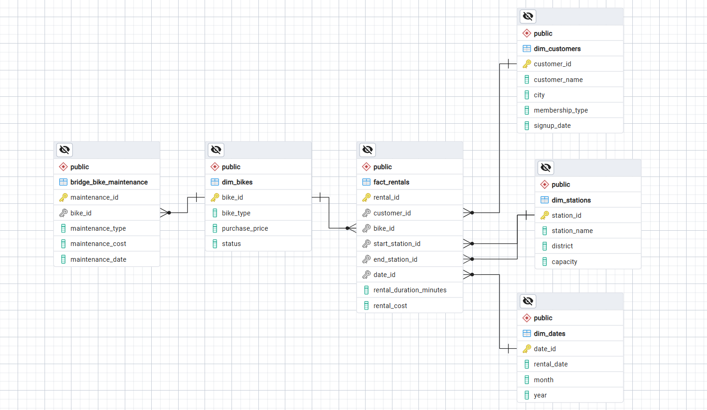

# Bike Rental SQL Analysis Project

## Project Overview

This project demonstrates SQL skills through the analysis of a fictitious bike rental system. The goal is to answer real-world business questions related to customer behavior, operations, and profitability.

This project is inspired by real-world SQL analytics workflows where data is queried to generate actionable insights.

---

## Database Schema

### Fact Table

- `fact_rentals` → contains rental transactions

### Dimension Tables

- `dim_customers` → customer details
- `dim_bikes` → bike information (type, etc.)
- `dim_stations` → station and district info
- `dim_dates` → date breakdown (month, etc.)

### Bridge Table

- `bridge_bike_maintenance` → maintenance records per bike

---

## Project files

This project is organized into individual SQL files, where each file contains the query used to answer a specific business question.

- [01_customer_rentals.sql](./Queries/01_customer_rentals.sql) - Retrieves customer names, bike types, and rental durations to provide a general overview of rental behavior.
- [02_longest_bike_rental.sql](./Queries/02_longest_bike_rental.sql) - Identifies the single longest rental duration to highlight extreme usage patterns.
- [03_average_rental_duration.sql](.Queries/03_average_rental_duration.sql) - Calculates the average rental duration for each bike type to compare usage trends.
- [04_most_active_stations.sql](.Queries/04_most_active_stations.sql) - Determines which stations have the highest number of rentals, helping identify high-demand locations.
- [05_customers_with_more_than_5_rentals.sql](./Queries/05_customers_with_more_than_5_rentals.sql) - Lists customers with more than a set number of rentals to identify loyal or high-frequency users.
- [06_rentals_with_missing_end_stations.sql](./Queries/06_rentals_with_missing_end_stations.sql) - Detects rentals that have not yet been returned, useful for identifying operational or tracking issues.
- [07_total_revenue_per_month.sql](./Queries/07_total_revenue_per_month.sql) - Aggregates total revenue by month to analyze financial performance over time.
- [08_bikes_that_never_had_maintenance.sql](./Queries/08_bikes_that_never_had_maintenance.sql) - Finds bikes with no maintenance records, highlighting potential operational risks.
- [09_average_maintenance_cost_per_bike.sql](./Queries/09_average_maintenance_cost_per_bike.sql) - Computes the average maintenance cost per bike type to assess cost efficiency.
- [10_top_5_longest_rentals.sql](./Queries/10_top_5_longest_rentals.sql) - Retrieves the top 5 longest rentals to identify high-value usage patterns.
- [11_profit_per_rental.sql](./Queries/11_profit_per_rental.sql) - Calculates profit per rental by comparing rental revenue against maintenance costs.
- [12_districts_with_high_rental_activity.sql](./Queries/12_districts_with_high_rental_activity.sql) - Identifies districts with high rental activity to support geographic optimization decisions.

---

## Key Business Questions

This project answers the following:

1. **Customer rental behavior** - This explores how customers use the service, including which bike types they prefer (electric vs standard) and how long they typically rent them. Understanding this helps optimize fleet composition and pricing strategies.
2. **Longest rental duration** - Identifying the longest rental helps determine extreme usage behavior and whether pricing or time limits need adjustment to maximize revenue.
3. **Average rental duration per bike type** - This compares usage between bike types to understand which assets generate more engagement and potentially more revenue.
4. **Most active rental stations** - This identifies high-traffic locations, helping the business allocate more bikes, improve station capacity, and prioritize operations in busy areas.
5. **High-frequency customers** - Recognizing repeat customers allows the business to design loyalty programs, subscriptions, or targeted promotions.
6. **Unreturned bikes** - This helps detect operational issues such as lost bikes, delayed returns, or system gaps, which may impact revenue and inventory tracking.
7. **Monthly revenue trends** - Analyzing monthly revenue trends helps identify growth patterns, seasonality, and opportunities for marketing campaigns or pricing adjustments.
8. **Bikes with no maintenance** - Analyzing monthly revenue trends helps identify growth patterns, seasonality, and opportunities for marketing campaigns or pricing adjustments.
9. **Average maintenance cost per bike type** - Understanding maintenance costs helps evaluate the profitability and sustainability of each bike type.
10. **Top longest rentals** - This identifies high-value usage patterns and may indicate customers who are more engaged or rely heavily on the service.
11. **Profit per rental** - This identifies high-value usage patterns and may indicate customers who are more engaged or rely heavily on the service.
12. **High-demand districts** - This evaluates the financial performance of each rental and helps determine whether pricing strategies are sustainable.

---

## Key Insights

- **Strong Demand for Electric Bikes with Slightly Longer Usage**  
  Electric bikes show marginally higher average rental duration compared to standard bikes, indicating a customer preference for convenience and efficiency. This suggests that expanding the electric bike fleet could improve customer satisfaction and revenue potential.

- **Rental Activity is Concentrated in Specific Stations and Districts**  
  A small number of stations (e.g., University Loop, Central Park Station) and districts (District 1 and District 3) account for the highest rental volumes. This indicates demand clustering, where operational resources such as bike allocation and maintenance should be prioritized.

- **Revenue Shows a Consistent Upward Trend Over Time**  
  Monthly revenue increases from January to March, suggesting growing demand or improved utilization. This trend presents opportunities for scaling operations, adjusting pricing strategies, or expanding to new locations.

- **Presence of High-Value and Repeat Customers**  
  Several customers have more than 10 rentals, highlighting a loyal user base. This creates opportunities for implementing loyalty programs, subscriptions, or targeted promotions to retain and monetize these users further.

- **Operational Risk Due to High Number of Unreturned Bikes**  
  A significant number of rentals have no recorded return (NULL end station), which may indicate ongoing rentals, system tracking issues, or lost assets. This poses risks to inventory management and revenue tracking.

- **Some Rentals are Generating Negative Profit**  
  Analysis shows that maintenance costs can exceed rental revenue for certain transactions, resulting in losses. This highlights the need to review pricing models, maintenance scheduling, or bike lifecycle management.

- **Bikes Without Maintenance Present Reliability Risks**  
  Several bikes have no maintenance history, which could lead to breakdowns, increased long-term costs, and poor customer experience. Preventive maintenance strategies should be implemented.

- **Maintenance Costs are Comparable Across Bike Types**  
  Average maintenance costs for electric and standard bikes are relatively similar, suggesting that electric bikes do not significantly increase operational expenses and may provide better return on investment due to higher usage.

- **Rental Duration Peaks Suggest Potential Pricing Optimization**  
  Multiple rentals reach the same maximum duration (118 minutes), indicating a possible cap or behavioral pattern. This suggests an opportunity to introduce tiered pricing or extended rental incentives.

---

## Tools Used

- **Query Engine**: PostgreSQL
- **Database Management tool** - pgAdmin
- **Development tools** - VS Code + Bash CLI + psql (CLI for Postgres)
- **Version Control** - Git & GitHub

---

## Key Skills Demonstrated

- **SQL Joins** (`INNER`, `LEFT`, `FULL`) - Used to combine data across multiple tables (fact and dimension tables) to create a complete view of rental transactions, customer details, bike information, and station data
- **Aggregations** (`SUM`, `AVG`, `COUNT`) - Applied to calculate key business metrics such as total revenue, average rental duration, maintenance costs, and customer activity levels.
- **Grouping & Filtering** (`GROUP BY`, `HAVING`) - Used to segment data into meaningful categories (e.g., by bike type, district, or customer) and filter results based on business conditions such as high-demand districts or frequent customers.
- **Data Cleaning & Handling NULL Values** - Managed missing or incomplete data (e.g., unreturned bikes or missing maintenance records) using conditions like `IS NULL`, ensuring accurate analysis and highlighting potential operational issues.
- **Sorting & Ranking** (`ORDER BY`, `LIMIT`) - Used to identify top-performing records such as longest rentals, most active stations, and top customers, enabling prioritization and decision-making.
- **Working with a Star Schema Data Model** - Queried a structured dataset consisting of fact and dimension tables, simulating a real-world data warehouse environment commonly used in analytics and business intelligence roles.
- **Business Logic Implementation in SQL** - Incorporated real-world calculations such as profit (`rental_cost - maintenance_cost`) directly into SQL queries, demonstrating the ability to translate business rules into data logic.
